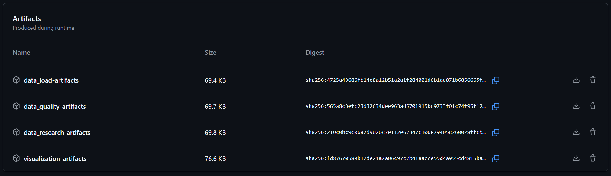
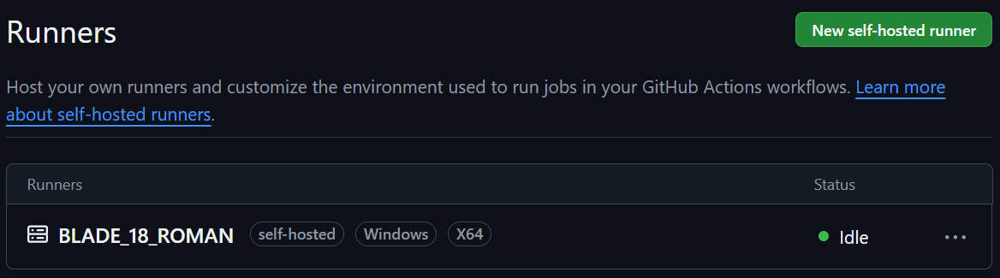
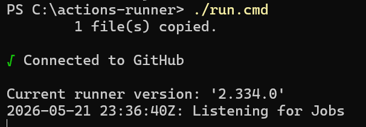
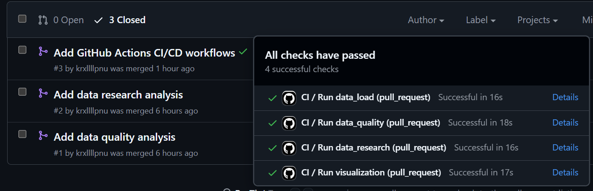
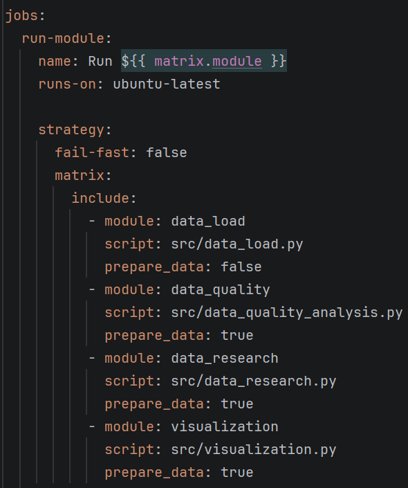
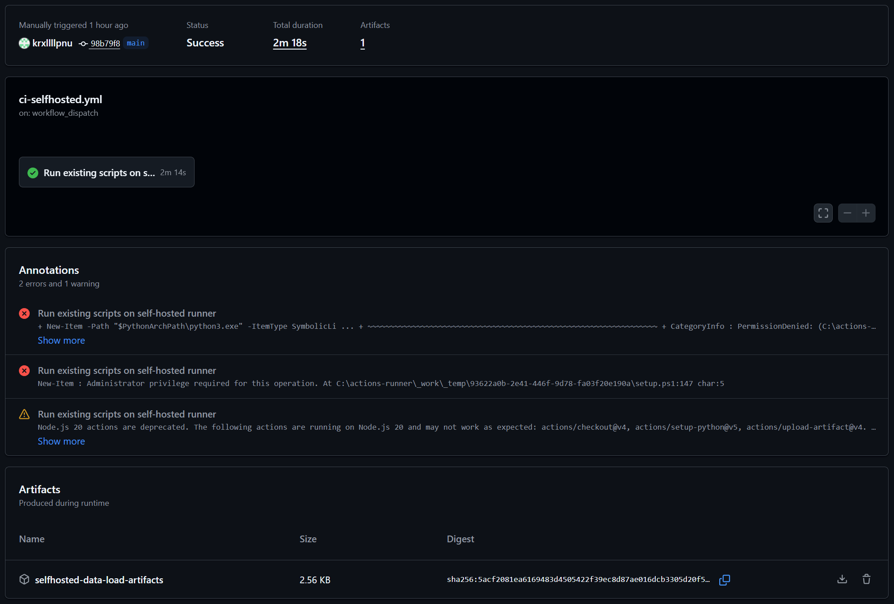

# Звіт до лабораторної роботи №2

## Тема

Налаштування CI/CD workflow для проєкту `open-data-ai-analytics` з використанням GitHub Actions, GitHub-hosted runner та self-hosted runner.

## Мета роботи

Метою лабораторної роботи є створення автоматизованого CI/CD pipeline для репозиторію на GitHub. Розглядається налаштування workflow, автоматичний запуск перевірок, збереження результатів виконання у вигляді artifacts та порівнянню GitHub-hosted і self-hosted runners.

## Короткий опис проєкту

Для виконання роботи використано репозиторій:

```text
open-data-ai-analytics
```

Цей репозиторій уже був створений у попередній лабораторній роботі та містив базову структуру Python-проєкту для аналізу відкритих даних. У межах цієї лабораторної роботи до нього було додано CI/CD конфігурацію.

## Додані та змінені файли

У межах лабораторної роботи було додано або оновлено такі основні файли:

```text
.github/workflows/ci.yml
.github/workflows/ci-selfhosted.yml
requirements.txt
README.md
CHANGELOG.md
```

Також було оновлено скрипт візуалізації, щоб він використовував `matplotlib`, а залежності проєкту були явно описані у `requirements.txt`.

## Основний GitHub Actions workflow

Для основного CI workflow було створено файл:

```text
.github/workflows/ci.yml
```

Цей workflow запускається у трьох випадках:

```yaml
on:
  push:
    branches: [main]
  pull_request:
    branches: [main]
  workflow_dispatch:
```

Тобто pipeline автоматично перевіряє зміни при push у `main`, при створенні або оновленні pull request, а також може бути запущений вручну.

Основний workflow виконується на GitHub-hosted runner:

```yaml
runs-on: ubuntu-latest
```

Це означає, що GitHub створює тимчасове чисте середовище, виконує всі кроки workflow і після завершення видаляє його.

## Matrix strategy

В основному workflow використано matrix strategy. Вона дозволяє запускати кілька частин pipeline окремо, але в межах однієї конфігурації.

У workflow були використані такі модулі:

```text
data_load
quality
research
visualization
```

Кожен модуль відповідає запуску окремого скрипта проєкту. Завдяки цьому у GitHub Actions окремо видно, який саме етап пройшов успішно, а який міг завершитися з помилкою.

## Основні кроки CI workflow

Основний CI workflow виконує такі дії:

1. Завантажує код репозиторію через `actions/checkout`.
2. Налаштовує Python-середовище.
3. Встановлює залежності з `requirements.txt`.
4. Створює папку для результатів виконання.
5. Запускає відповідний модуль згідно з matrix.
6. Збирає згенеровані файли та логи.
7. Завантажує результати як GitHub Actions artifacts.

Таким чином, pipeline не просто запускає код, а також зберігає результати виконання, які можна переглянути або завантажити після завершення workflow.

## Artifacts

Artifacts використовуються для збереження результатів workflow. У межах цієї роботи artifacts потрібні для того, щоб після запуску CI можна було перевірити результати виконання скриптів.

До artifacts можуть входити:

- логи виконання;
- текстові звіти;
- згенеровані результати аналізу;
- графіки або інші файли, створені під час pipeline.

**Artifacts основного GitHub Actions workflow**



## Workflow для self-hosted runner

Окремо було створено workflow:

```text
.github/workflows/ci-selfhosted.yml
```

Він запускається вручну за допомогою `workflow_dispatch` і використовує локальний runner:

```yaml
runs-on: self-hosted
```

На відміну від GitHub-hosted runner, цей workflow виконується не на сервері GitHub, а на локальному комп’ютері, де було встановлено GitHub Actions Runner.

## Налаштування self-hosted runner

Self-hosted runner було налаштовано через розділ GitHub:

```text
Settings → Actions → Runners → New self-hosted runner
```

Для Windows x64 було створено папку:

```text
C:\actions-runner
```

Після завантаження та конфігурації runner був запущений командою:

```powershell
.\run.cmd
```

Після цього runner почав очікувати jobs від GitHub Actions. Коли вручну було запущено workflow `ci-selfhosted.yml`, job виконалась на локальній машині.

**Self-hosted runner зі статусом Online**



**Локальний термінал із запущеним runner**



## Результат запуску основного CI

Основний workflow було перевірено через pull request. Після створення PR GitHub Actions автоматично запустив `ci.yml`. Це підтвердило, що trigger `pull_request` налаштований правильно.

**Автоматичний запуск CI на pull request**



**Matrix jobs основного workflow**



## Результат запуску self-hosted workflow

Self-hosted workflow було запущено вручну через вкладку GitHub Actions. Після запуску локального runner job була виконана на власному комп’ютері та завершилася зі статусом `Success`.

Під час запуску були показані annotations, пов’язані з правами доступу Windows для створення symbolic link під час налаштування Python. Однак workflow завершився успішно, а artifact було створено. Це означає, що self-hosted runner був правильно підключений і зміг виконати job.

**Успішний запуск ci-selfhosted.yml**



## Порівняння GitHub-hosted і self-hosted runner

| Критерій                     | GitHub-hosted runner        | Self-hosted runner                          |
| ---------------------------- | --------------------------- | ------------------------------------------- |
| Місце виконання              | Сервери GitHub              | Локальний ПК або власний сервер             |
| Налаштування                 | Мінімальне                  | Потрібно встановити та зареєструвати runner |
| Середовище                   | Чисте при кожному запуску   | Залежить від локальної машини               |
| Доступ до локальних ресурсів | Немає                       | Можливий                                    |
| Доступність                  | Забезпечується GitHub       | Залежить від того, чи увімкнений runner     |
| Безпека                      | Більш ізольоване середовище | Потребує обережності з доступами            |
| Основне застосування         | Стандартний CI для PR/push  | Специфічне або локальне середовище          |

GitHub-hosted runner краще підходить для стандартної автоматичної перевірки pull requests, тому що він забезпечує чисте та відтворюване середовище. Self-hosted runner корисний тоді, коли потрібно виконувати workflow на власній машині або в середовищі з особливими налаштуваннями.

## Переваги та недоліки self-hosted runner

Переваги self-hosted runner:

- можна використовувати власне середовище;
- можна мати доступ до локальних ресурсів;
- можна заздалегідь встановити потрібні інструменти;
- можна запускати workflow на конкретній ОС або машині.

Недоліки self-hosted runner:

- комп’ютер має бути увімкнений;
- runner має бути запущений;
- можливі проблеми з правами доступу;
- середовище може бути менш відтворюваним;
- є додаткові ризики безпеки.

## Pull request і коміти

Зміни було винесено в окрему гілку:

```text
feature/github-actions-ci
```

Після цього було створено pull request у `main`. Це дозволило перевірити роботу CI саме на події `pull_request`.

У роботі були використані такі коміти:

```text
refactor: use matplotlib for visualizations
ci: add GitHub Actions workflows
docs: update changelog and lab report
```

Такий поділ дозволяє окремо бачити зміни в коді візуалізації, CI/CD конфігурації та документації.

## Changelog і тег

Для фіксації результатів роботи було оновлено `CHANGELOG.md` і додано нову версію:

```text
v0.2.0
```

Ця версія відповідає CI/CD lab release і включає додавання GitHub Actions workflows, self-hosted runner workflow, artifacts та оновлення документації.

## Висновок

У результаті лабораторної роботи було налаштовано CI/CD pipeline для репозиторію `open-data-ai-analytics` за допомогою GitHub Actions.

Основний workflow `ci.yml` автоматично запускається на `push`, `pull_request` і вручну через `workflow_dispatch`. У ньому використано GitHub-hosted runner, matrix strategy, встановлення залежностей, запуск модулів проєкту та завантаження результатів як artifacts.

Додатково було створено workflow `ci-selfhosted.yml`, який запускається вручну на self-hosted runner. Runner було налаштовано на локальному комп’ютері з Windows, після чого workflow успішно виконався та створив artifact.

Отже, мету лабораторної роботи було досягнуто: CI/CD workflow створено, автоматичний запуск на pull request перевірено, artifacts налаштовано, а self-hosted runner успішно протестовано.

