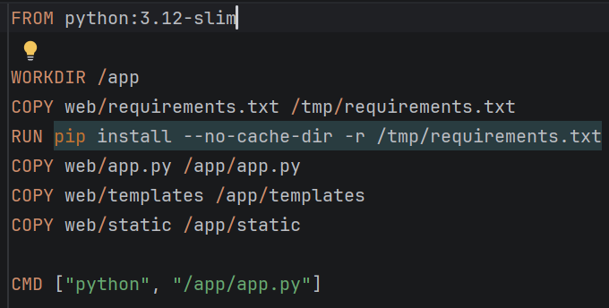
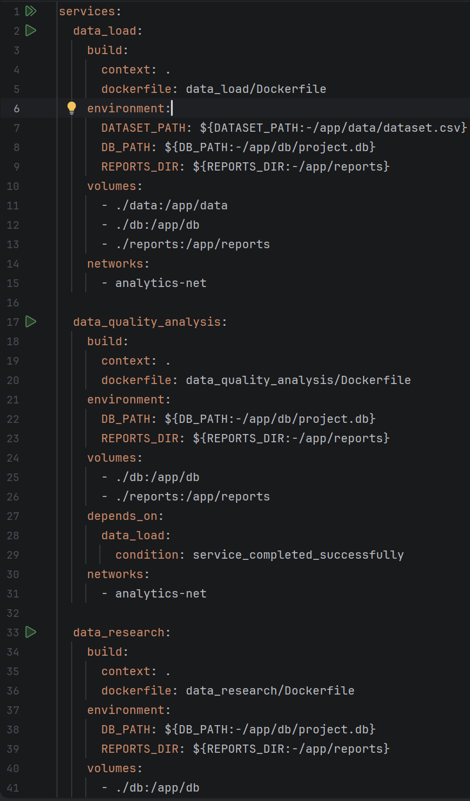
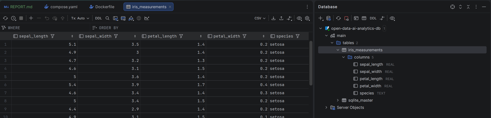
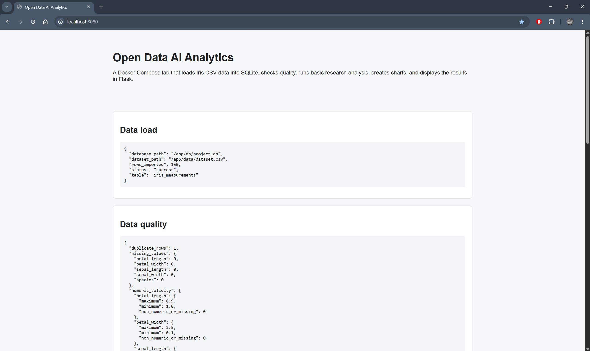
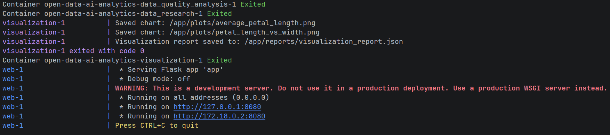
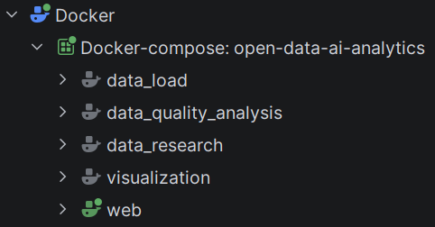

# Звіт до лабораторної роботи №3

## Тема

Створення Docker-образів та керування контейнерами для проєкту `open-data-ai-analytics`.

## Мета роботи

Метою лабораторної роботи є контейнеризація багатомодульного Python-проєкту та організація його запуску за допомогою Docker Compose. У межах роботи потрібно було підготувати окремі Docker-образи для сервісів обробки даних, налаштувати спільні volumes, мережу контейнерів, SQLite-базу даних, генерацію звітів і веб-інтерфейс для перегляду результатів.

## Короткий опис проєкту

Для виконання роботи використано репозиторій:

```text
open-data-ai-analytics
```

Цей репозиторій був створений у попередніх лабораторних роботах. У лабораторній роботі №1 було реалізовано базовий Git/GitHub workflow, модулі завантаження, аналізу якості, дослідження даних і візуалізації. У лабораторній роботі №2 було додано GitHub Actions CI/CD workflow, artifacts і self-hosted runner. У лабораторній роботі №3 проєкт було адаптовано до запуску в Docker-контейнерах.

## Основна ідея реалізації

Проєкт було розділено на кілька окремих сервісів, кожен з яких виконує власну роль у pipeline обробки даних:

- `data_load` — завантажує CSV-дані та імпортує їх у SQLite-базу даних;
- `data_quality_analysis` — аналізує якість даних і формує JSON-звіт;
- `data_research` — виконує базовий дослідницький аналіз і формує JSON-звіт;
- `visualization` — створює графіки за допомогою `matplotlib` і зберігає їх у форматі PNG;
- `web` — запускає Flask-вебінтерфейс для перегляду результатів роботи pipeline.

Для запуску всіх сервісів використовується Docker Compose. Це дозволяє запускати весь проєкт однією командою:

```bash
docker compose up --build
```

## Структура проєкту

Після виконання лабораторної роботи структура проєкту має такий вигляд:

```text
open-data-ai-analytics/
├── data/
│   └── dataset.csv
├── data_load/
│   ├── app.py
│   ├── Dockerfile
│   └── requirements.txt
├── data_quality_analysis/
│   ├── app.py
│   ├── Dockerfile
│   └── requirements.txt
├── data_research/
│   ├── app.py
│   ├── Dockerfile
│   └── requirements.txt
├── visualization/
│   ├── app.py
│   ├── Dockerfile
│   └── requirements.txt
├── web/
│   ├── app.py
│   ├── templates/
│   │   └── index.html
│   ├── static/
│   ├── Dockerfile
│   └── requirements.txt
├── db/
├── reports/
├── plots/
├── compose.yaml
├── .env.example
├── .gitignore
├── README.md
└── CHANGELOG.md
```

## Додані та змінені файли

У межах лабораторної роботи було додано або оновлено такі основні файли:

```text
compose.yaml
.env.example
.gitignore
README.md
CHANGELOG.md
data_load/Dockerfile
data_quality_analysis/Dockerfile
data_research/Dockerfile
visualization/Dockerfile
web/Dockerfile
web/app.py
web/templates/index.html
```

Також було адаптовано Python-модулі, щоб вони могли працювати в контейнеризованому середовищі, використовували спільні шляхи до даних, бази даних, звітів і графіків, а результати зберігали у відповідні директорії.

## Dockerfile для сервісів

Для кожного сервісу було створено окремий `Dockerfile`. Такий підхід дозволяє ізолювати залежності та запуск кожного модуля. Кожен контейнер має власний набір Python-залежностей, описаний у відповідному `requirements.txt`.

Основна логіка Dockerfile полягає в тому, що контейнер:

1. використовує Python-образ як базовий;
2. встановлює залежності з `requirements.txt`;
3. копіює код сервісу;
4. запускає відповідний `app.py`.

Це робить кожен модуль самостійним сервісом, який може бути запущений через Docker Compose.

**Dockerfile одного з сервісів**



## Docker Compose конфігурація

Для запуску всіх сервісів було створено файл:

```text
compose.yaml
```

У цьому файлі описано всі контейнери проєкту, спільну мережу, volumes і змінні середовища. Docker Compose забезпечує послідовний та відтворюваний запуск усієї системи.

Основні елементи Compose-конфігурації:

- сервіси `data_load`, `data_quality_analysis`, `data_research`, `visualization`, `web`;
- спільна Docker-мережа для контейнерів;
- volumes для директорій `data`, `db`, `reports`, `plots`;
- змінні середовища для шляхів до dataset, SQLite DB, reports і plots;
- порт `8080` для доступу до вебінтерфейсу;
- залежності між сервісами через `depends_on`.

**Файл compose.yaml у редакторі**



## Змінні середовища

Для документування конфігурації було додано файл:

```text
.env.example
```

Приклад змінних середовища:

```text
DATASET_PATH=/app/data/dataset.csv
DB_PATH=/app/db/project.db
REPORTS_DIR=/app/reports
PLOTS_DIR=/app/plots
WEB_PORT=8080
```

Ці змінні дозволяють не прив’язувати код до жорстко заданих шляхів. Завдяки цьому один і той самий код може працювати як локально, так і всередині Docker-контейнерів.

## SQLite база даних

Для зберігання імпортованих даних було використано SQLite. Це просте рішення, яке добре підходить для лабораторної роботи, тому що не потребує окремого контейнера бази даних або складної конфігурації.

Файл бази даних зберігається у спільній директорії:

```text
db/project.db
```

Сервіс `data_load` створює базу даних, створює таблицю та імпортує дані з CSV-файлу. Інші сервіси можуть використовувати цю базу як джерело даних для аналізу.

Для перевірки роботи бази даних використано інтеграцію PyCharm Database.

**SQLite база даних у PyCharm Database tool window**



## Модуль data_load

Сервіс `data_load` відповідає за початковий етап pipeline. Він читає CSV-файл із директорії `data`, створює SQLite-базу даних і записує туди дані.

Результатом роботи сервісу є:

- створений файл `db/project.db`;
- таблиця з імпортованими записами;
- звіт про завантаження даних у директорії `reports`.

Цей модуль є основою для наступних етапів, оскільки інші сервіси використовують підготовлені дані для аналізу.

## Модуль data_quality_analysis

Сервіс `data_quality_analysis` виконує перевірку якості даних. У межах цього модуля аналізуються:

- кількість пропущених значень;
- наявність дублікатів;
- типи колонок;
- базові характеристики набору даних.

Результат зберігається у JSON-файлі:

```text
reports/data_quality_report.json
```

Перехід від текстового формату до JSON робить результати зручнішими для подальшої обробки та відображення у вебінтерфейсі.

## Модуль data_research

Сервіс `data_research` виконує базовий дослідницький аналіз даних. Він обчислює статистичні характеристики та формує короткий підсумок результатів.

Результат зберігається у файлі:

```text
reports/data_research_report.json
```

JSON-формат дозволяє вебсервісу легко прочитати результати аналізу та показати їх на сторінці.

## Модуль visualization

Сервіс `visualization` відповідає за створення графіків. Для побудови візуалізацій використовується бібліотека `matplotlib`, яка підходить для запуску в CI/CD та Docker-середовищах.

Результатом роботи сервісу є два PNG-графіки в директорії:

```text
plots/
```

Також створюється JSON-звіт зі списком згенерованих графіків:

```text
reports/visualization_report.json
```

## Web-сервіс

Окремий сервіс `web` запускає Flask-застосунок. Він читає результати з директорій `reports` і `plots`, після чого відображає їх у браузері.

Вебінтерфейс доступний за адресою:

```text
http://localhost:8080
```

На головній сторінці відображається:

- короткий опис проєкту;
- статус завантаження даних;
- результати перевірки якості даних;
- результати дослідницького аналізу;
- згенеровані графіки.

Таким чином, вебсервіс демонструє результат роботи всього контейнеризованого pipeline.

**Вебінтерфейс на localhost:8080**



## Запуск проєкту

Для запуску контейнеризованого проєкту використовується команда:

```bash
docker compose up --build
```

Ця команда збирає Docker-образи, створює контейнери, підключає volumes і запускає всі сервіси згідно з `compose.yaml`.

Перед запуском можна перевірити коректність Compose-файлу командою:

```bash
docker compose config
```

Після успішного запуску потрібно відкрити вебінтерфейс у браузері:

```text
http://localhost:8080
```

**Запуск docker compose up --build**



**Список сервісів docker compose**



## Volumes і збереження результатів

У роботі використовуються спільні volumes або bind mounts для директорій:

```text
data/
db/
reports/
plots/
```

Це потрібно для того, щоб результати роботи контейнерів зберігалися на локальній машині та були доступні іншим сервісам. Наприклад, `data_load` створює базу даних у `db/`, а `web` може прочитати результати з `reports/` і `plots/`.

Таким чином, volumes забезпечують обмін даними між контейнерами та збереження результатів після завершення роботи контейнерів.

## Docker network

У `compose.yaml` також використовується спільна Docker-мережа для сервісів. Це дозволяє контейнерам бути частиною одного ізольованого середовища. У цій лабораторній роботі основний обмін даними відбувається через спільні volumes, але мережа все одно є важливою частиною Docker Compose конфігурації, особливо для вебсервісу та потенційної взаємодії між контейнерами.

## Висновок

У результаті лабораторної роботи було контейнеризовано багатомодульний Python-проєкт `open-data-ai-analytics`. Для кожного основного модуля було створено окремий Dockerfile, а для спільного запуску всіх сервісів було налаштовано `compose.yaml`.

Проєкт тепер можна запустити однією командою `docker compose up --build`. Після запуску створюється SQLite-база даних, генеруються JSON-звіти, будуються PNG-графіки, а результати доступні через Flask-вебінтерфейс на `localhost:8080`.

Лабораторна робота показала, як Docker і Docker Compose допомагають зробити проєкт більш відтворюваним, структурованим і зручним для запуску в однаковому середовищі.

