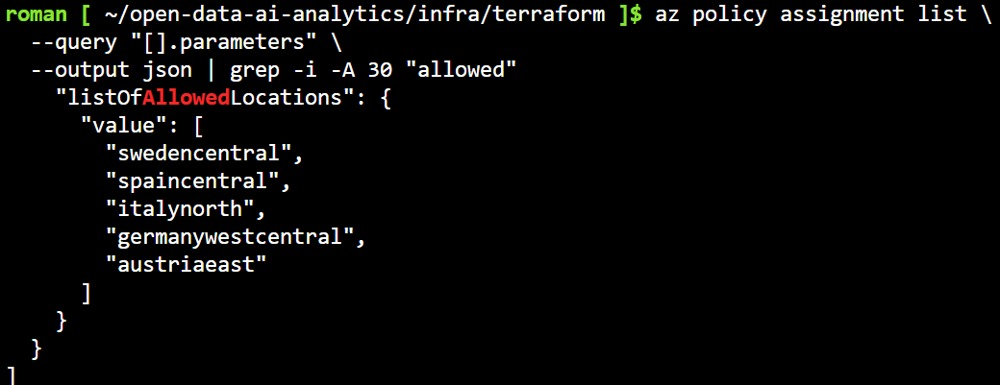
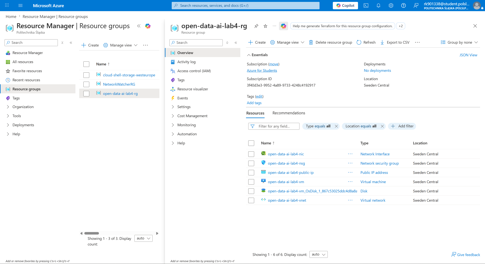
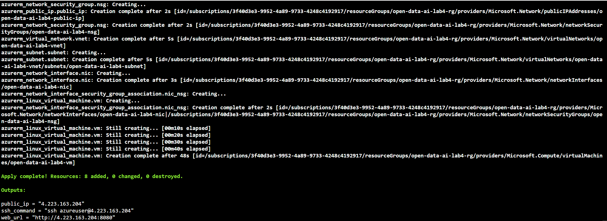
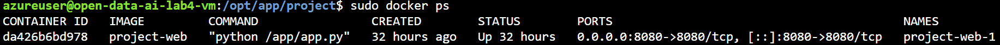
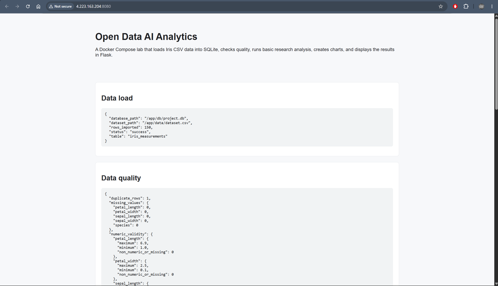

# Звіт до лабораторної роботи №4

## Тема

Розгортання Docker-проєкту `open-data-ai-analytics` у Microsoft Azure за допомогою Terraform, Azure Cloud Shell та `cloud-init`.

## Мета роботи

Метою лабораторної роботи було перенести вже контейнеризований Docker-проєкт у хмарне середовище Azure та автоматизувати створення інфраструктури засобами Terraform. У межах роботи потрібно було підготувати каталог `infra/terraform`, описати ресурси Azure як код, запустити розгортання через Azure Cloud Shell, перевірити доступність вебінтерфейсу через public IP та після завершення роботи видалити створені ресурси, щоб не витрачати Azure credits.

## Використаний проєкт

Для виконання роботи використано GitHub-репозиторій:

```text
https://github.com/krxllllpnu/open-data-ai-analytics
```

Проєкт уже містить Docker-конфігурацію у файлі:

```text
compose.yaml
```

У цій лабораторній роботі основний акцент був не на зміні логіки Python-модулів або Docker-сервісів, а на хмарному розгортанні на Linux VM в Azure.

## Структура доданих файлів

Для Terraform-конфігурації було додано окремий каталог:

```text
infra/terraform/
├── main.tf
├── variables.tf
├── outputs.tf
└── cloud-init.yaml
```

Файл `main.tf` містить опис Azure-ресурсів. Файл `variables.tf` містить параметри розгортання: назву проєкту, регіон, розмір VM, порт застосунку, шлях до SSH-ключа, URL репозиторію та назву Compose-файлу. Файл `outputs.tf` виводить public IP, URL вебінтерфейсу та SSH-команду. Файл `cloud-init.yaml` відповідає за автоматичне налаштування VM після її створення.

## Ресурси, які створює Terraform

Terraform створює повний мінімальний набір ресурсів, потрібний для запуску Docker-проєкту у хмарі:

- Resource Group для групування всіх ресурсів лабораторної роботи;
- Virtual Network для мережевої інфраструктури;
- Subnet як окрему підмережу для VM;
- Public IP address для доступу до вебінтерфейсу з браузера;
- Network Security Group з правилами для SSH та вебпорту;
- Network Interface для підключення VM до мережі;
- Linux Virtual Machine на Ubuntu 22.04 LTS.

У цій роботі було використано регіон `swedencentral`, оскільки політика Azure for Students дозволяла створення ресурсів лише в обмеженому наборі регіонів. Також було використано VM size `Standard_B2s_v2`, оскільки початковий варіант `Standard_B1s` був недоступний для поточної підписки в обраному регіоні.

**Список дозволених Azure-регіонів**



**Ресурси, створені Terraform у Resource Group**



## Запуск Terraform

Terraform-команди виконувалися з каталогу:

```bash
cd infra/terraform
```

Спочатку було ініціалізовано Terraform:

```bash
terraform init
```

Потім було виконано форматування та перевірку конфігурації:

```bash
terraform fmt
terraform validate
```

Після цього було виконано розгортання інфраструктури:

```bash
terraform apply \
  -var="ssh_public_key_path=$HOME/.ssh/id_rsa.pub"
```

У фінальній версії значення `repo_url`, `location`, `vm_size`, `compose_file` та `app_port` задані у `variables.tf`, тому їх не потрібно передавати щоразу вручну. Основні значення:

```text
location     = swedencentral
vm_size      = Standard_B2s_v2
compose_file = compose.yaml
app_port     = 8080
```

Після підтвердження `yes` Terraform створив 6 ресурсів. У результаті було отримано public IP, SSH-команду та URL вебінтерфейсу.

**Успішний apply з outputs**



## Що робить cloud-init

`cloud-init` виконується автоматично під час першого запуску створеної Linux VM. У цій роботі він використовується для того, щоб не налаштовувати сервер вручну після створення.

Сценарій `cloud-init.yaml` виконує такі дії:

1. оновлює список пакетів Ubuntu;
2. встановлює Git, Curl та службові пакети;
3. додає Docker repository;
4. встановлює Docker Engine і Docker Compose plugin;
5. вмикає та запускає Docker service;
6. клонує GitHub-репозиторій у `/opt/app/project`;
7. запускає Docker-проєкт командою `docker compose -f compose.yaml up -d`.

## Запуск Docker-проєкту на VM

Після створення VM `cloud-init` автоматично запускає Docker Compose. Для ручної перевірки можна підключитися до VM через SSH:

```bash
ssh azureuser@<PUBLIC_IP>
```

Після підключення можна перевірити статус контейнерів:

```bash
cd /opt/app/project
sudo docker ps
sudo docker compose -f compose.yaml ps
```

Якщо потрібно переглянути логи сервісів, використовується команда:

```bash
sudo docker compose -f compose.yaml logs --tail=100
```

Ці команди дозволяють перевірити, що Docker встановився, репозиторій було склоновано, а сервіси з `compose.yaml` запущені на VM.

**Список запущених Docker-контейнерів на VM**



## Перевірка працездатності

Після успішного `terraform apply` Terraform вивів `web_url`. Для перевірки результату цей URL було відкрито у браузері:

```text
http://<PUBLIC_IP>:8080
```

Також працездатність можна перевірити з Cloud Shell за допомогою:

```bash
curl http://<PUBLIC_IP>:8080
```

Працюючий вебінтерфейс підтверджує, що інфраструктура створена правильно, порт `8080` відкритий у Network Security Group, Docker-проєкт запущений на VM, а Flask web-сервіс доступний ззовні через public IP.

**Працюючий вебінтерфейс через public IP**



## Видалення ресурсів

Після завершення перевірки ресурси потрібно видалити, щоб не витрачати Azure credits. Для цього використовується команда:

```bash
terraform destroy \
  -var="ssh_public_key_path=$HOME/.ssh/id_rsa.pub"
```

Після запуску Terraform показує список ресурсів, які будуть видалені. Для підтвердження потрібно ввести:

```text
yes
```

Після успішного завершення має з’явитися повідомлення про видалення ресурсів. Це важливий етап лабораторної роботи, оскільки VM, Public IP та інші Azure-ресурси можуть продовжувати споживати credits, якщо залишити їх активними.

## Висновок

У результаті лабораторної роботи було розгорнуто Docker-проєкт `open-data-ai-analytics` у Microsoft Azure. Terraform використано для опису та створення інфраструктури як коду, а Azure Cloud Shell — як середовище для виконання команд без локального встановлення Terraform або Azure CLI.

Terraform створив Resource Group, мережеві ресурси, Public IP, Network Security Group, Network Interface та Linux Virtual Machine. `cloud-init` автоматизував початкове налаштування VM: встановив Docker, склонував GitHub-репозиторій та запустив Docker Compose на основі `compose.yaml`.

Працездатність було перевірено через Terraform outputs, Azure Portal, SSH-підключення до VM, команди Docker Compose та відкриття вебінтерфейсу через public IP. Після перевірки передбачено видалення ресурсів за допомогою `terraform destroy`, щоб уникнути зайвого використання Azure credits.

