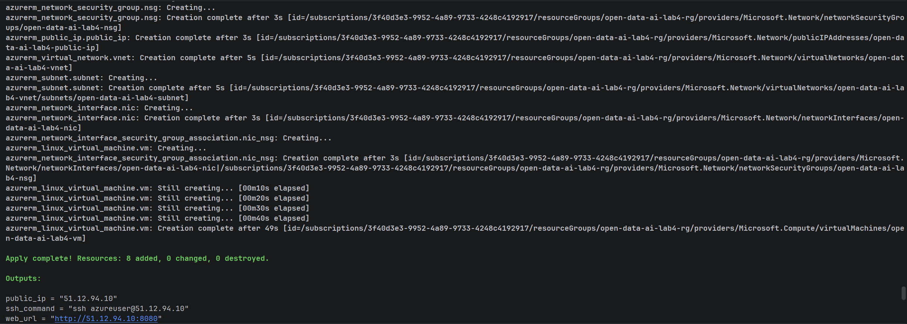
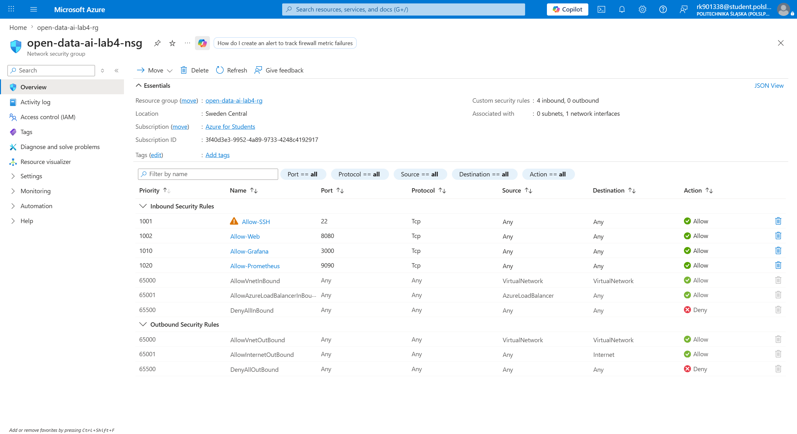
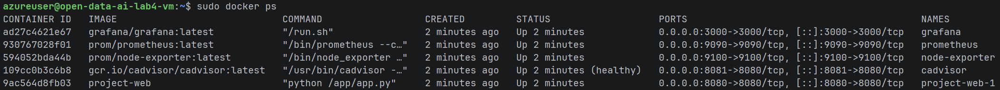
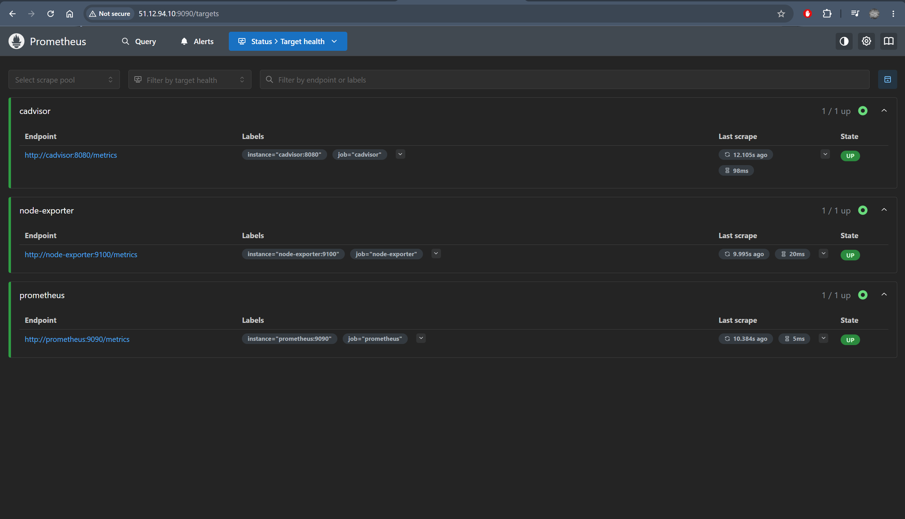
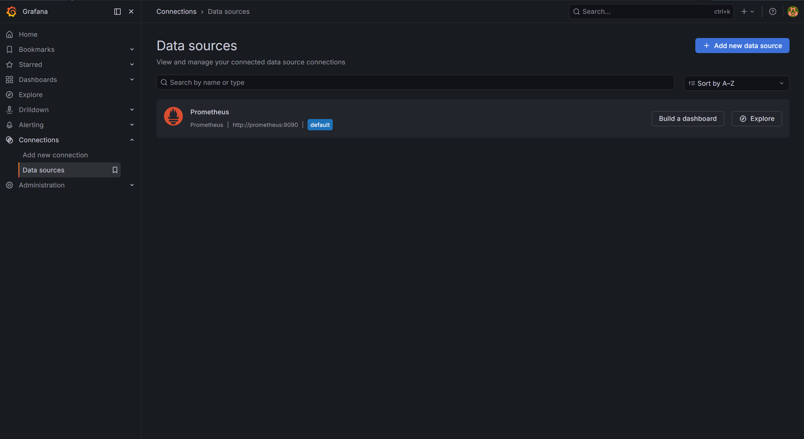
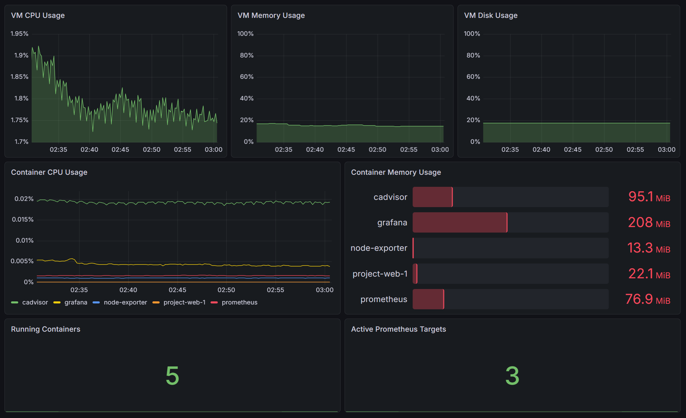

# Звіт до лабораторної роботи №5

## Тема

Моніторинг Docker-застосунку, контейнерів і віртуальної машини Azure за допомогою Prometheus та Grafana.

## Мета роботи

Метою лабораторної роботи було доповнити попередньо розгорнутий у Microsoft Azure Docker-проєкт системою моніторингу. Основне завдання полягало в тому, щоб організувати збір технічних метрик із Linux VM та Docker-контейнерів, передати ці метрики до Prometheus і візуалізувати їх у Grafana за допомогою dashboard.

На відміну від попередньої роботи, де основний акцент був зроблений на створенні Azure-інфраструктури та запуску Docker Compose, у цій роботі увага була зосереджена саме на спостереженні за станом розгорнутого середовища: завантаженням CPU, використанням RAM, дисковим простором, станом контейнерів і доступністю Prometheus targets.

## Використані інструменти

У роботі було використано такі інструменти та сервіси:

- Microsoft Azure для запуску Linux Virtual Machine;
- Terraform для опису й оновлення інфраструктури;
- `cloud-init` для автоматизації налаштування VM після provisioning;
- Docker Compose для запуску основного застосунку та monitoring stack;
- Prometheus для збору метрик;
- Node Exporter для метрик Linux VM;
- cAdvisor для метрик Docker-контейнерів;
- Grafana для візуалізації метрик.

## Зміни в структурі проєкту

Для моніторингу було додано окремий каталог `monitoring`, щоб не змішувати monitoring stack з основним `compose.yaml` застосунку.

```text
monitoring/
├── docker-compose.monitoring.yml
├── prometheus/
│   └── prometheus.yml
└── grafana/
    └── provisioning/
        └── datasources/
            └── prometheus.yml
```

Файл `docker-compose.monitoring.yml` описує сервіси Prometheus, Grafana, Node Exporter і cAdvisor. Файл `prometheus.yml` містить список джерел метрик, які має опитувати Prometheus. Файл `grafana/provisioning/datasources/prometheus.yml` автоматично додає Prometheus як datasource у Grafana.

## Джерела метрик

У цій лабораторній роботі було використано три основні джерела метрик.

Першим джерелом є сам Prometheus. Він збирає власні службові метрики, що дозволяє перевірити, чи працює система збору даних і чи доступний сам Prometheus endpoint.

Другим джерелом є Node Exporter. Він надає метрики операційної системи Linux VM: використання процесора, оперативної памʼяті, дискового простору, файлових систем та інших системних ресурсів.

Третім джерелом є cAdvisor. Він використовується для збору метрик Docker-контейнерів: використання CPU, RAM, стан контейнерів і ресурсне навантаження окремих сервісів.

У Prometheus ці джерела були описані як окремі scrape jobs:

```yaml
scrape_configs:
  - job_name: prometheus
    static_configs:
      - targets:
          - prometheus:9090

  - job_name: node-exporter
    static_configs:
      - targets:
          - node-exporter:9100

  - job_name: cadvisor
    static_configs:
      - targets:
          - cadvisor:8080
```

Зовнішньо для користувача було відкрито лише Grafana на порту `3000` та Prometheus на порту `9090`. Порти Node Exporter і cAdvisor не відкривалися публічно, оскільки вони потрібні тільки для внутрішнього збору метрик між контейнерами.

## Оновлення Terraform та cloud-init

Для доступу до інтерфейсів моніторингу були додані правила Network Security Group для портів:

```text
3000 — Grafana
9090 — Prometheus
```

SSH-порт `22` залишився для підключення до VM. Порти `9100` і `8081` не відкривалися назовні, оскільки вони не потрібні для перегляду результатів у браузері.

Також було оновлено `cloud-init`, щоб після створення VM автоматично запускати не лише основний Docker-застосунок, а й monitoring stack. Логіка `cloud-init` була зроблена так, щоб репозиторій або клонувати, або оновлювати через `git pull`, а після цього запускати Docker Compose з каталогу `monitoring`.

Основна команда для запуску monitoring stack:

```bash
cd /opt/app/project/monitoring
sudo docker compose -f docker-compose.monitoring.yml up -d
```

**Terraform apply після оновлення інфраструктури**



**Network Security Group rules для Grafana та Prometheus**



## Запуск і перевірка контейнерів

Після merge змін у `main` віртуальна машина отримала оновлену версію репозиторію, і monitoring stack було запущено за допомогою Docker Compose.

Для перевірки використовувалася команда:

```bash
sudo docker ps
```

У списку контейнерів повинні бути присутні:

```text
prometheus
grafana
node-exporter
cadvisor
```

Також разом із ними працював контейнер основного web-застосунку. Це підтверджує, що моніторинг був запущений паралельно з основним проєктом, а не замість нього.

**Запущені Docker-контейнери на Azure VM**



## Перевірка Prometheus

Prometheus було відкрито у браузері за адресою:

```text
http://<PUBLIC_IP>:9090
```

Для перевірки джерел метрик використовувалася сторінка:

```text
http://<PUBLIC_IP>:9090/targets
```

На цій сторінці всі основні targets повинні мати стан `UP`:

```text
prometheus
node-exporter
cadvisor
```

Стан `UP` означає, що Prometheus успішно опитує відповідний exporter і отримує від нього метрики.

**Prometheus targets у стані UP**



## Налаштування Grafana

Grafana була доступна за адресою:

```text
http://<PUBLIC_IP>:3000
```

Для входу використовувалися стандартні облікові дані:

```text
admin / admin
```

Prometheus datasource був доданий автоматично через provisioning-файл. Після входу в Grafana було перевірено, що datasource `Prometheus` успішно підключається до Prometheus API.

**Prometheus datasource у Grafana**



## Виведені метрики

Для dashboard у Grafana були виведені метрики, які показують стан віртуальної машини та контейнерів.

### VM CPU Usage

Метрика показує відсоток використання CPU на Linux VM. Для цього використовувалися дані Node Exporter з метрики `node_cpu_seconds_total`.

PromQL-запит:

```promql
100 - (avg by(instance) (rate(node_cpu_seconds_total{mode="idle"}[5m])) * 100)
```

Ця метрика дозволяє побачити, чи є значне навантаження на VM під час запуску Docker-сервісів або роботи застосунку.

### VM Memory Usage

Метрика показує відсоток використання оперативної памʼяті VM. Для цього порівнюється доступна памʼять із загальним обсягом RAM.

```promql
(1 - (node_memory_MemAvailable_bytes / node_memory_MemTotal_bytes)) * 100
```

Ця панель допомагає оцінити, чи вистачає обраного розміру VM для запуску основного застосунку та monitoring stack.

### VM Disk Usage

Метрика показує використання дискового простору root filesystem.

```promql
100 - ((node_filesystem_avail_bytes{mountpoint="/", fstype!="rootfs"} * 100) / node_filesystem_size_bytes{mountpoint="/", fstype!="rootfs"})
```

У роботі ця метрика була важливою, оскільки Docker images, volumes і системні пакети займають місце на диску VM.

### Container CPU Usage

Метрика показує використання CPU окремими контейнерами. Для dashboard було використано групування за назвою контейнера:

```promql
sum by (name) (rate(container_cpu_usage_seconds_total{name!=""}[5m]))
```

Це дозволяє порівняти навантаження від Grafana, Prometheus, cAdvisor, Node Exporter та основного web-контейнера.

### Container Memory Usage

Метрика показує використання RAM окремими контейнерами:

```promql
sum by (name) (container_memory_usage_bytes{name!=""})
```

Для цієї панелі було обрано bar gauge, оскільки він наочно показує, який контейнер споживає найбільше памʼяті.

### Running Containers

Метрика показує кількість контейнерів, які бачить cAdvisor:

```promql
count(container_last_seen{name!=""})
```

У результаті було видно, що Prometheus отримує інформацію про контейнери monitoring stack та основного web-сервісу.

### Active Prometheus Targets

Метрика показує кількість активних Prometheus targets:

```promql
sum(up)
```

У результаті dashboard показував 3 активні targets: Prometheus, Node Exporter і cAdvisor.

**Grafana dashboard з метриками VM та контейнерів**



## Труднощі під час виконання

Під час виконання роботи виникло кілька технічних труднощів.

Перша проблема була повʼязана з тим, що початково monitoring stack не запустився на VM автоматично. Причина полягала в тому, що `cloud-init` тягнув зміни з гілки `main`, а monitoring-файли ще не були змерджені в `main`. Після merge змін у головну гілку репозиторій на VM було оновлено, і monitoring stack запустився коректно.

Друга проблема стосувалася SSH-ключа. Під час переходу з Azure Cloud Shell на локальний запуск Terraform потрібно було створити локальний ключ. Спочатку було згенеровано ключ `ed25519`, але Azure VM у поточній Terraform-конфігурації приймала тільки RSA SSH key. Після створення RSA-ключа та передачі шляху через змінну Terraform `plan` і `apply` виконалися коректно.

Третя складність була повʼязана з Grafana dashboard. Datasource Prometheus створився автоматично, але сам dashboard не був provisioned через JSON-файл. Тому dashboard було створено вручну в Grafana, після чого були додані панелі з PromQL-запитами для VM і контейнерів.

## Спостереження за результатами моніторингу

За результатами моніторингу було видно, що VM працює стабільно після запуску всіх контейнерів. На графіку CPU спочатку спостерігався короткий пік навантаження, що можна пояснити запуском Docker-контейнерів і початковим збором метрик. Після цього використання CPU знизилося до невеликого рівня.

Використання оперативної памʼяті залишалося помірним. Найбільше памʼяті серед контейнерів використовувала Grafana, що є очікуваним, оскільки вона відповідає за вебінтерфейс і візуалізацію dashboard. Prometheus також використовував помітний обсяг памʼяті, оскільки зберігає часові ряди метрик.

Disk usage залишався стабільним і не показував швидкого зростання протягом короткого періоду спостереження. Це означає, що для короткої лабораторної демонстрації обраного дискового простору достатньо.

Prometheus показав 3 активні targets, що підтверджує коректну роботу всіх джерел метрик. Також cAdvisor відображав 5 контейнерів, тобто моніторинг охопив як monitoring stack, так і основний web-контейнер проєкту.

## Висновок

У результаті лабораторної роботи до Azure-розгортання проєкту було додано повноцінний monitoring stack на основі Prometheus і Grafana. Prometheus використовувався для збору метрик, Node Exporter — для системних метрик Linux VM, а cAdvisor — для метрик Docker-контейнерів.

Було налаштовано окремий Docker Compose файл для моніторингу, Prometheus scrape configuration, Grafana datasource provisioning, а також правила Azure Network Security Group для доступу до Grafana та Prometheus. `cloud-init` було оновлено так, щоб monitoring stack міг запускатися автоматично після provisioning VM.

У Grafana було створено dashboard з основними метриками: CPU, RAM і disk usage для VM, CPU і memory usage для контейнерів, кількість контейнерів та кількість активних Prometheus targets. Отримані результати показали, що VM має помірне навантаження, контейнери працюють стабільно, а Prometheus успішно збирає метрики з усіх налаштованих джерел.

Лабораторна робота показала, як після розгортання застосунку в хмарі можна організувати базовий моніторинг інфраструктури та контейнерів. Такий підхід дозволяє не лише перевірити факт запуску сервісів, а й спостерігати за їхнім станом і ресурсним навантаженням у реальному часі.
