# Звіт до лабораторної роботи №6

## Тема

GitOps-розгортання застосунку в k3s за допомогою Argo CD та автоматизація deployment-середовища на Azure VM.

## Мета роботи

Метою лабораторної роботи було перейти від звичайного запуску контейнерів на віртуальній машині до GitOps-підходу, у якому бажаний стан застосунку описується у Git-репозиторії, а Kubernetes-кластер автоматично синхронізує цей стан через Argo CD.

У попередніх роботах основний акцент був зроблений на контейнеризації, запуску проєкту через Docker Compose, розгортанні Azure VM за допомогою Terraform та налаштуванні моніторингу. У цій роботі ці напрацювання були використані як основа, але головна увага була зосереджена на Kubernetes manifests, Argo CD Application, окремій deployment-гілці `prod`, автоматичному завантаженні Docker image з GitHub Container Registry та перевірці автоматичного оновлення застосунку після зміни в Git.

## Використані інструменти

У лабораторній роботі було використано такі інструменти:

- Microsoft Azure для створення Linux Virtual Machine;
- Terraform для опису інфраструктури та правил доступу;
- `cloud-init` для первинного налаштування VM;
- Docker Compose для запуску batch pipeline та monitoring stack;
- GitHub Actions для збірки та публікації Docker image;
- GitHub Container Registry для зберігання image вебзастосунку;
- k3s як легковаговий Kubernetes-кластер на одній VM;
- Argo CD для GitOps-синхронізації Kubernetes manifests;
- Prometheus і Grafana для перевірки стану середовища після розгортання.

## Загальна архітектура рішення

Після змін проєкт було розділено на кілька логічних частин. Docker Compose залишився відповідальним за запуск контейнерів, які виконують data pipeline: завантаження даних, аналіз якості, дослідження та генерацію візуалізацій. Ці контейнери не є довготривалими сервісами, тому їх не було перенесено в Kubernetes як `Deployment`.

Вебзастосунок було винесено в k3s і описано через Kubernetes manifests. Argo CD отримує ці manifests з гілки `prod` і підтримує стан кластера відповідно до вмісту репозиторію. Такий підхід дозволяє демонструвати GitOps: зміна у Git призводить до зміни фактичного стану Kubernetes-кластера.

Monitoring stack залишився у Docker Compose, оскільки він був налаштований у попередній лабораторній роботі. Для збереження результатів моніторингу dashboard Grafana було винесено в JSON-файл і підключено через provisioning.

Схему можна описати так:

```text
GitHub repository
├── main  — основна гілка розробки
└── prod  — гілка, з якої Argo CD синхронізує deployment

GitHub Actions
└── збирає Docker image та публікує його в GHCR

Azure VM
├── Docker Compose: data pipeline + monitoring
└── k3s + Argo CD: web service
```

## Зміни у структурі проєкту

Для GitOps-частини було додано каталог `gitops`, у якому зберігається опис Kubernetes-ресурсів:

```text
gitops/
├── app/
│   ├── namespace.yaml
│   ├── deployment.yaml
│   └── service.yaml
└── argocd/
    └── application.yaml
```

Файл `namespace.yaml` створює окремий namespace для застосунку. У `deployment.yaml` описано запуск web-компонента у k3s, а `service.yaml` відкриває доступ до нього через NodePort. Файл `application.yaml` описує Argo CD Application, який синхронізує manifests із гілки `prod`.

Також було додано окремі скрипти для встановлення k3s та Argo CD:

```text
scripts/
├── install-k3s.sh
└── install-argocd.sh
```

Вони використовуються під час bootstrap VM через `cloud-init` і дозволяють винести логіку встановлення з Terraform-конфігурації в окремі зрозумілі файли.

## Гілка `prod` для GitOps-розгортання

Для розгортання було використано окрему гілку `prod`. Основна гілка `main` використовується для розробки та merge готових змін, а `prod` є джерелом стану для Argo CD.

Такий підхід зменшує ризик випадкового deployment незавершених змін. Argo CD не синхронізує кожен commit із `main`, а оновлює кластер тільки після того, як зміни потрапили в `prod`.

Оновлення `prod` виконувалося після merge змін у `main`:

```bash
git checkout prod
git merge main
git push origin prod
```

У Argo CD Application було вказано:

```yaml
targetRevision: prod
path: gitops/app
```

Таким чином, GitOps-цикл привʼязаний саме до deployment-гілки.

## Публікація Docker image у GHCR

На відміну від Docker Compose, Kubernetes не збирає image з `Dockerfile` під час запуску `Deployment`. Йому потрібен уже готовий image, доступний у container registry. Тому для web-компонента було додано GitHub Actions workflow, який автоматично збирає Docker image та публікує його в GitHub Container Registry.

Для цього було створено workflow:

```text
.github/workflows/docker-publish.yml
```

Він запускається після push у відповідні гілки та публікує image у форматі:

```text
ghcr.io/<owner>/<repository>:latest
```

У Kubernetes Deployment цей image використовується як джерело для запуску web pod. Для лабораторної демонстрації було використано тег `latest` разом із `imagePullPolicy: Always`, щоб кластер завантажував актуальну версію image.

**Успішний GitHub Actions workflow для публікації image**

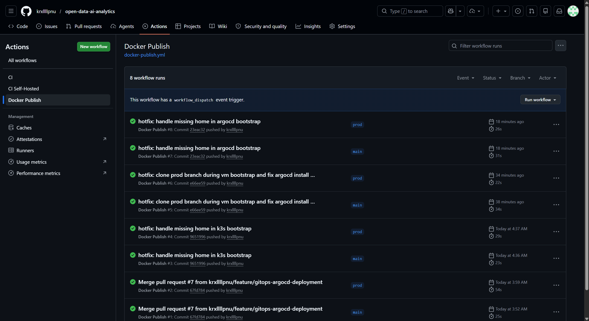

**Опублікований Docker image у GitHub Container Registry**

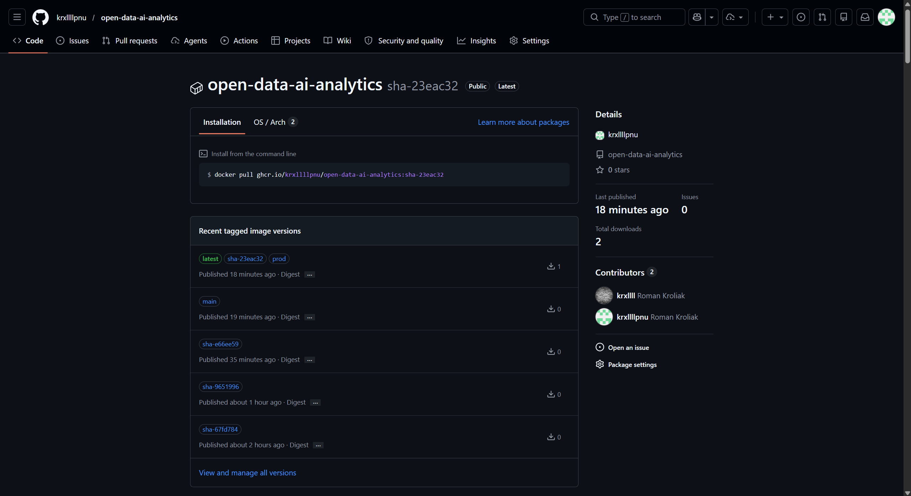

## Роль Docker Compose після перенесення web у Kubernetes

Після додавання k3s web-сервіс більше не повинен запускатися на VM через Docker Compose у production/GitOps-сценарії, інакше одночасно працювали б два web-сервіси: один у Docker Compose, інший у Kubernetes. Щоб уникнути плутанини, web-контейнер було зроблено опціональним через Docker Compose profile.

Основні batch-контейнери залишаються в Compose:

```text
data_load
data_quality_analysis
data_research
visualization
```

Вони генерують файли у спільні директорії, зокрема `reports` і `plots`. Web-застосунок у Kubernetes читає ці результати через hostPath mounts на одновузловому k3s-кластері.

Цей підхід є компромісом для лабораторної роботи: data pipeline залишається простим і працює через Docker Compose, а GitOps демонструється на довготривалому web-сервісі. У production-сценарії batch-контейнери можна було б перенести у Kubernetes як `Job` або `CronJob`, а спільні файли зберігати через PVC або object storage.

## Автоматизація створення VM

Terraform було оновлено так, щоб VM після створення могла автоматично підготувати середовище для GitOps-розгортання. Під час bootstrap виконуються такі дії (не конкретно в такому порядку):

1. встановлення системних залежностей;
2. встановлення Docker і запуск monitoring stack;
3. клонування репозиторію з гілки `prod`;
4. встановлення k3s;
5. встановлення Argo CD;
6. застосування Argo CD Application;
7. відкриття необхідних портів через Network Security Group.

Для доступу до web-застосунку в Kubernetes було додано NodePort. Для доступу до Grafana та Prometheus залишилися відповідні правила, налаштовані в попередній лабораторній роботі.

Під час виконання виникли проблеми з `cloud-init`, оскільки скрипти запускалися в середовищі, де змінна `HOME` могла бути не задана. Через використання `set -euo pipefail` це призводило до зупинки скриптів. Проблему було виправлено за допомогою fallback-значення для home-директорії:

```bash
USER_HOME="${HOME:-/root}"
```

Також для надійності запуск bootstrap-скриптів було переведено на абсолютні шляхи, щоб cloud-init не залежав від поточної робочої директорії.

**Terraform apply для створення нової VM**

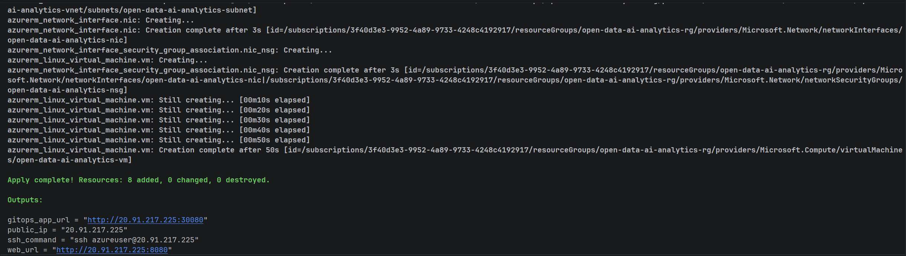

**Cloud-init log після успішного bootstrap**

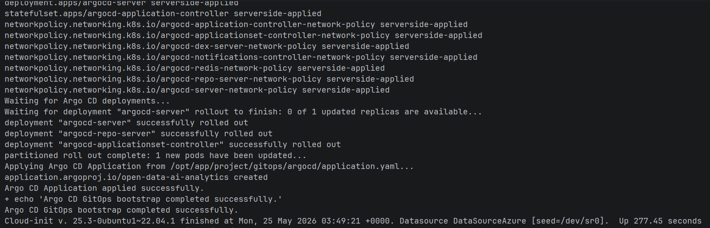

## Встановлення та перевірка k3s

Після створення VM було перевірено, що k3s-кластер працює, а node має статус `Ready`.

Для перевірки використовувалася команда:

```bash
sudo kubectl get nodes
```

Очікуваний результат — один node, який відповідає Azure VM, зі статусом `Ready`. Це підтверджує, що k3s успішно встановився та Kubernetes API доступний.

**k3s node у стані Ready**

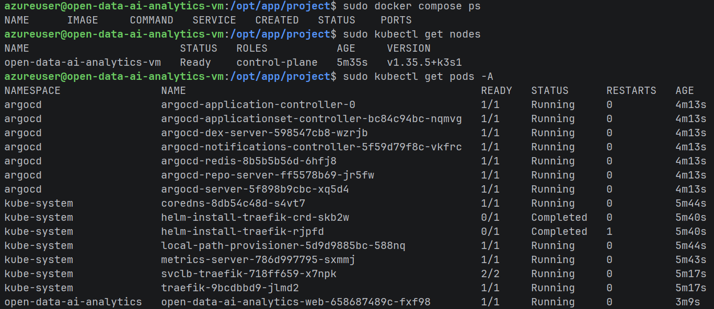

## Встановлення та перевірка Argo CD

Argo CD було встановлено в namespace `argocd`. Після встановлення було перевірено стан pod-ів:

```bash
sudo kubectl get pods -n argocd
```

Усі основні компоненти Argo CD повинні перейти у стан `Running`. Після цього було перевірено Argo CD Application:

```bash
sudo kubectl get applications -n argocd
```

Успішний стан Application означає, що Argo CD бачить Git-репозиторій, читає manifests із `gitops/app` і застосовує їх у Kubernetes-кластері.

Під час тестування також виникла помилка з Argo CD CRD:

```text
metadata.annotations: Too long: may not be more than 262144 bytes
```

Вона була повʼязана із застосуванням великих CRD через звичайний client-side `kubectl apply`. Для виправлення встановлення Argo CD було переведено на server-side apply.

**Argo CD Application зі статусом Synced/Healthy**

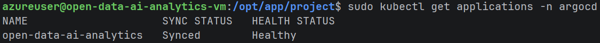

## Розгортання web-застосунку в Kubernetes

Після синхронізації Argo CD у namespace застосунку було створено Kubernetes Deployment і Service для web-компонента.

Для перевірки використовувалися команди:

```bash
sudo kubectl get all -n open-data-ai-analytics
sudo kubectl get svc -n open-data-ai-analytics
```

Deployment запускає web pod з image, опублікованого в GHCR. Service відкриває доступ до застосунку через NodePort. Web pod також має доступ до директорій із результатами data pipeline через volume mounts.

**Kubernetes resources web-застосунку**

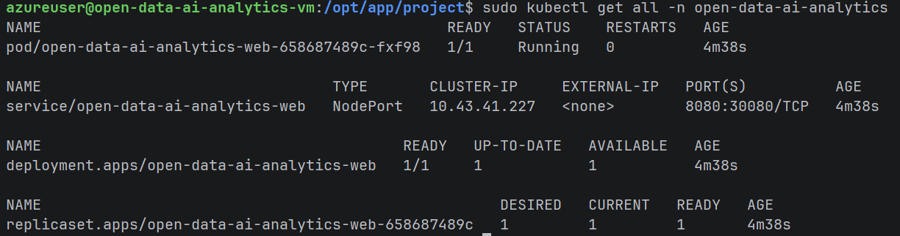

**Web-застосунок у браузері через NodePort**

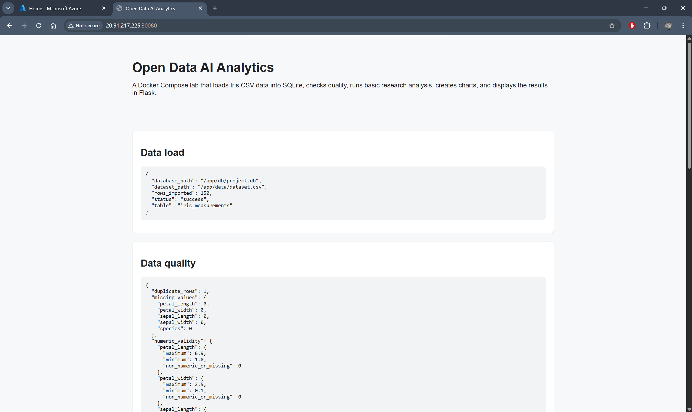

## Перевірка автоматичного GitOps-оновлення

Для перевірки GitOps-механізму було змінено кількість реплік web-застосунку в `gitops/app/deployment.yaml`. Після push зміни в гілку `prod` Argo CD автоматично виявив відмінність між бажаним станом у Git і фактичним станом у кластері.

Після синхронізації Kubernetes створив додатковий pod. Це було перевірено командою:

```bash
sudo kubectl get pods -n open-data-ai-analytics
```

У результаті було видно два pod-и web-застосунку у стані `Running`. Один pod мав більший вік, а другий був створений нещодавно, що підтвердило автоматичне масштабування після зміни в Git.

**Дві репліки web-застосунку після GitOps sync**

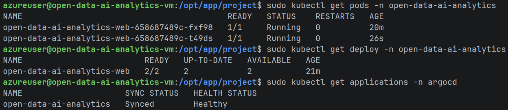

## Перевірка rollback

Для демонстрації rollback було виконано повернення зміни з кількістю реплік. Це можна зробити через `git revert` або окремий commit, який повертає значення replicas до попереднього стану.

Після цього Argo CD знову порівнює стан кластера з Git і приводить Kubernetes Deployment до потрібного стану. У результаті кількість pod-ів має повернутися до початкового значення.

**Revert для rollback у гілці prod**

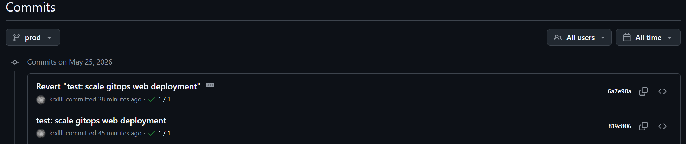

**Стан pod-ів після rollback**

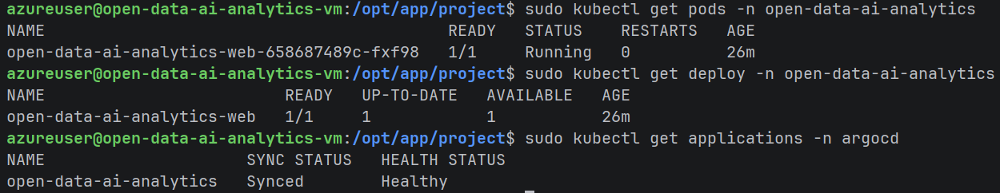

## Grafana dashboard provisioning

У попередній лабораторній dashboard Grafana створювався вручну. У цій роботі було покращено підхід: dashboard було експортовано в JSON-файл і додано до репозиторію.

Структура Grafana provisioning:

```text
monitoring/grafana/
├── dashboards/
│   └── app-dashboard.json
└── provisioning/
    ├── dashboards.yml
    └── datasources.yml
```

Файл `datasources.yml` автоматично додає Prometheus як datasource, а `dashboards.yml` вказує Grafana, звідки завантажувати dashboard JSON. Завдяки цьому після перестворення VM dashboard не потрібно створювати вручну.

**Автоматично provisioned Grafana dashboard**

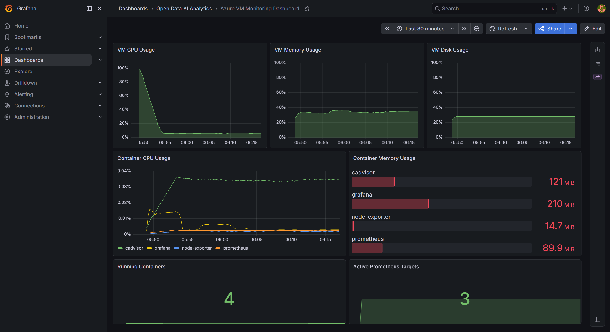

## Труднощі під час виконання

Під час виконання лабораторної роботи виникло кілька технічних проблем.

Перша проблема була повʼязана з тим, що Kubernetes потребує готового Docker image з registry, тоді як попередній Docker Compose-сценарій міг збирати image локально на VM. Для цього було додано GitHub Actions workflow, який публікує image у GHCR.

Друга проблема стосувалася поділу відповідальності між Docker Compose і Kubernetes. Оскільки data pipeline генерує файли, які використовує web, було важливо не просто перенести web у Kubernetes, а й забезпечити йому доступ до `reports` і `plots`. Для одновузлового k3s-кластера було використано hostPath mounts.

Третя проблема виникла під час cloud-init bootstrap. У середовищі cloud-init змінна `HOME` не завжди була задана, а скрипти використовували `set -euo pipefail`. Це спричинило помилки `HOME: unbound variable`. Для виправлення було додано fallback на `/root`.

Четверта проблема була повʼязана з установкою Argo CD CRD через звичайний `kubectl apply`. Через перевищення допустимого розміру annotations було використано server-side apply.

## Результати роботи

У результаті було отримано GitOps-сценарій розгортання web-застосунку в Kubernetes. Основні результати:

- створено Kubernetes manifests для namespace, Deployment і Service;
- створено Argo CD Application для синхронізації з гілки `prod`;
- налаштовано GitHub Actions workflow для публікації Docker image у GHCR;
- web-сервіс перенесено з Docker Compose у k3s;
- batch pipeline залишено в Docker Compose;
- налаштовано обмін файлами між pipeline і web через hostPath volumes;
- автоматизовано встановлення k3s та Argo CD через cloud-init scripts;
- додано provisioning для Grafana dashboard;
- перевірено автоматичне масштабування deployment після зміни кількості реплік у Git;
- перевірено можливість rollback через Git.

## Висновок

У ході лабораторної роботи було реалізовано GitOps-підхід для розгортання web-компонента проєкту на Azure VM з k3s. На відміну від попередніх робіт, де сервіси запускалися напряму через Docker Compose, у цій роботі бажаний стан web-застосунку було описано у Kubernetes manifests і передано під керування Argo CD.

Окрема гілка `prod` стала джерелом deployment-стану. Це дозволило відокремити розробку в `main` від фактичного розгортання. GitHub Actions забезпечив публікацію Docker image у GHCR, а k3s отримував уже готовий image для запуску pod-ів.

Під час роботи було збережено попередню логіку data pipeline: batch-контейнери продовжують виконуватися через Docker Compose і генерують файли для web. Web-застосунок, розгорнутий у Kubernetes, отримує доступ до цих файлів через спільні директорії VM. Такий підхід є практичним для одновузлової лабораторної VM і водночас показує, як систему можна поступово переносити до Kubernetes.

Перевірка зміни кількості реплік показала, що Argo CD автоматично синхронізує Kubernetes-кластер зі станом у Git. Це підтвердило основну ідею GitOps: Git є джерелом істини, а інфраструктура автоматично приводиться до описаного в ньому стану.